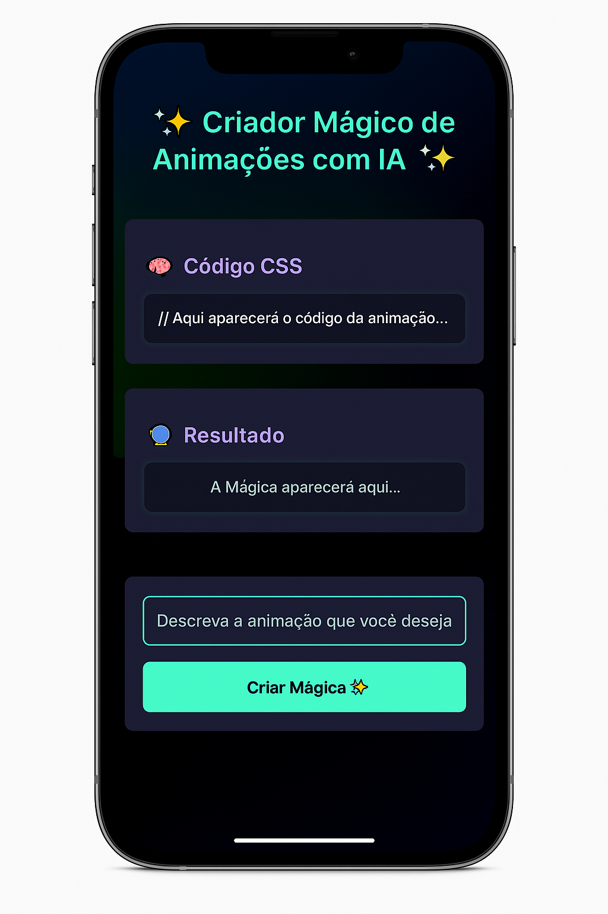
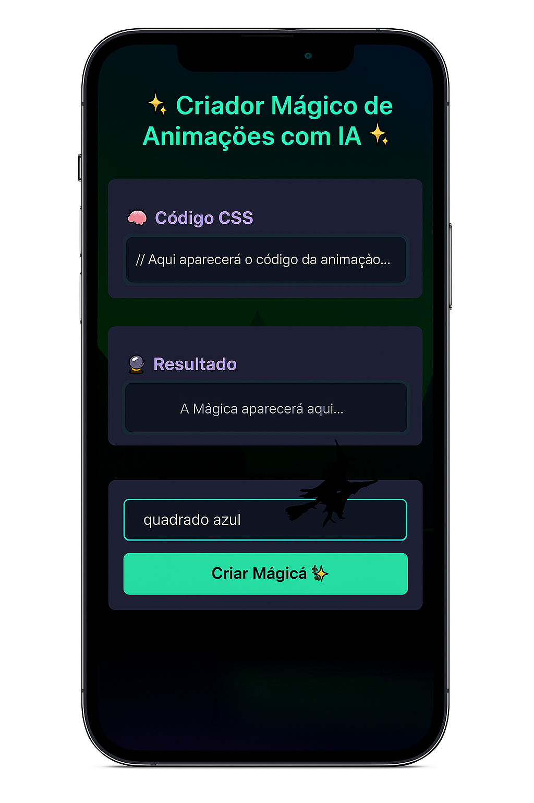
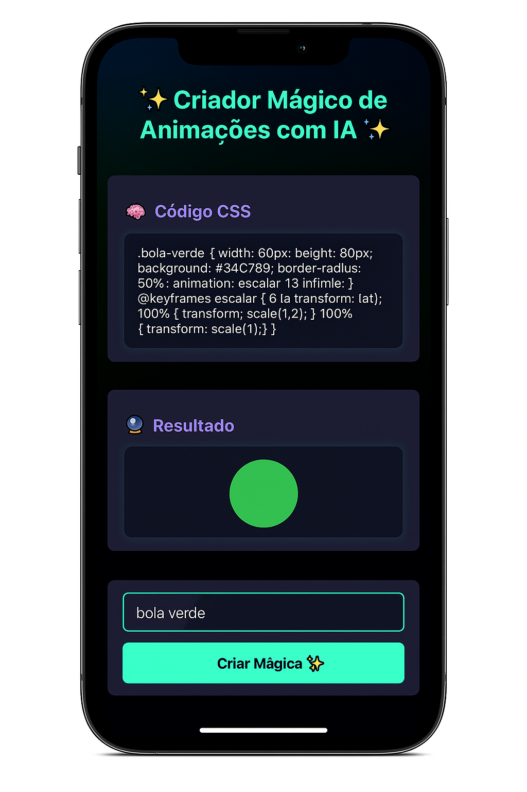

# ✨ Criador Mágico de Animações com IA ✨

Bem-vindo ao **Criador Mágico de Animações com IA**, um projeto interativo e responsivo que transforma descrições simples em **animações CSS automáticas**, com o toque da inteligência artificial!

> 🧙 Descreva a animação que você deseja e assista à mágica acontecer.

---

## 💡 Funcionalidades

✅ Geração automática de código CSS com base em texto  
✅ Visualização instantânea da animação criada  
✅ Interface intuitiva, colorida e responsiva  
✅ Integração com **Inteligência Artificial via n8n**  
✅ 100% feito com HTML, CSS, JavaScript e automação externa

---

## 📱 Veja como funciona

### A interface:



### Com animação sendo criada:



### Exemplo de animação gerada:



---

## 🛠️ Tecnologias utilizadas

- HTML  
- CSS (com foco em animações)  
- JavaScript  
- n8n (para integração com IA)  
- OpenAI API (para geração do código CSS)

---

## 🚀 Como usar

1. Clone o repositório:
   ```bash
   git clone https://github.com/adriciachiarini/gerador_imagem_codigo_css_ia_n8n
